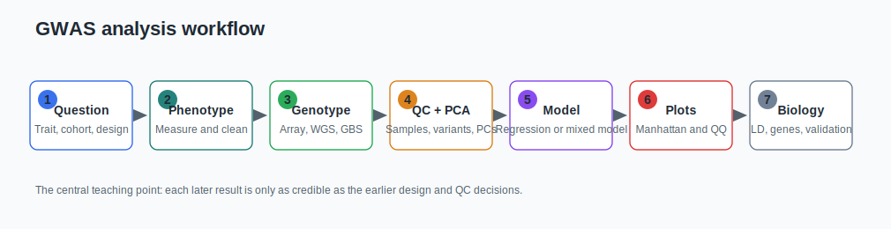
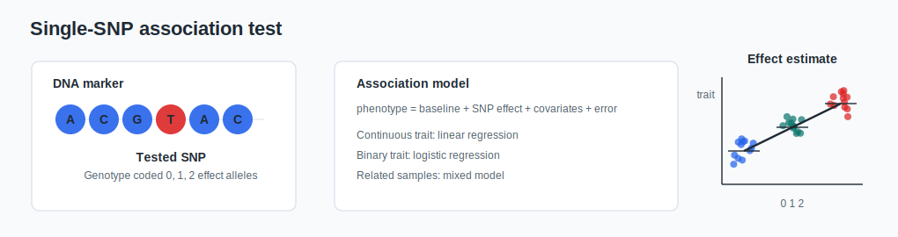
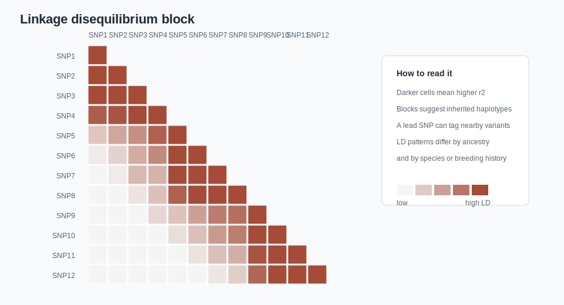
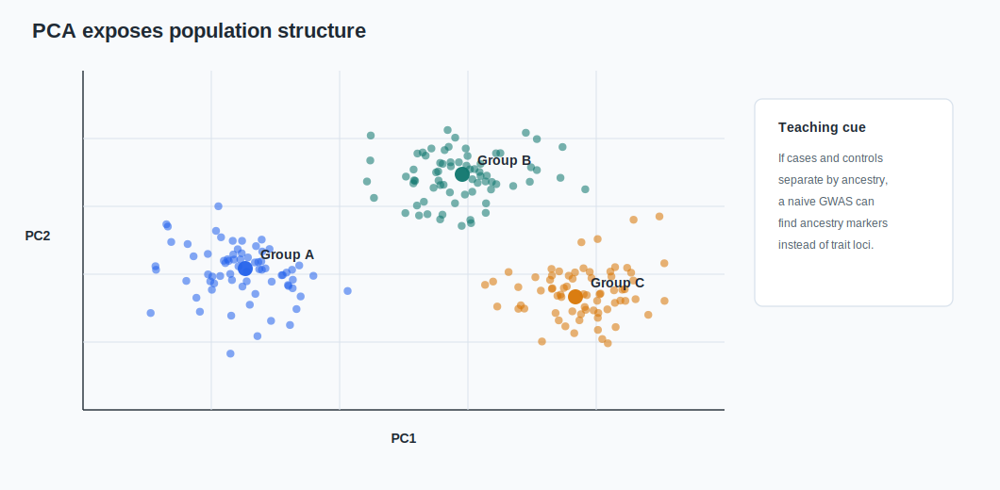
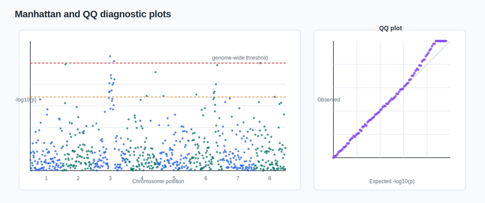
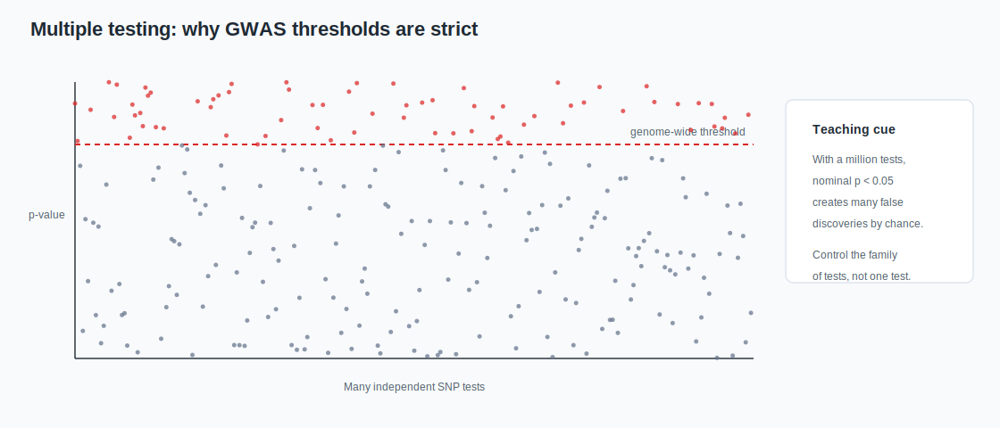
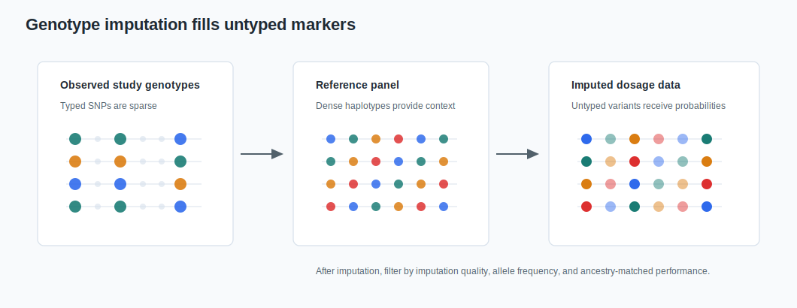
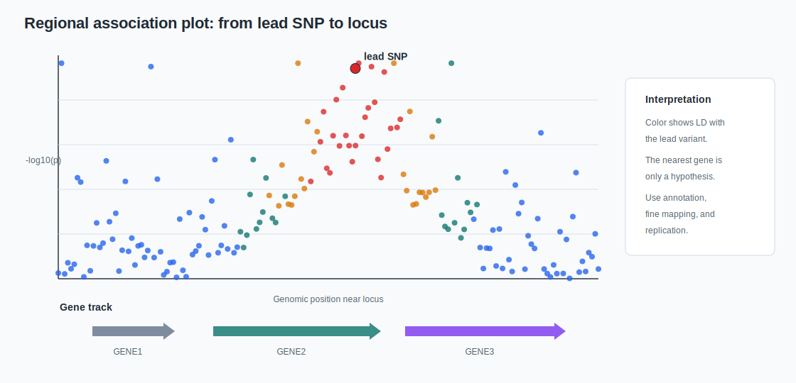

# Visual Guide

This chapter adds schematic figures and synthetic plots for the course. The figures are original SVG assets generated by `scripts/generate_figures.py`; they are not copied from the local PDF or from online articles.

The local PDF, `Decoding basic GWAS: The beginner's guide`, was used as a concept reference because it introduces SNPs, LD, Manhattan plots, QQ plots, population structure, GWAS workflow, models, and plant/crop examples. For public deployment, the figures below intentionally redraw those ideas as original teaching diagrams.

Online visual references used for design guidance include:

- Uffelmann et al. 2021, which frames GWAS as a sequence of study design, QC, association testing, visualization, and follow-up.
- FinnGen's guide to QQ and Manhattan plot interpretation.
- GWASLab's Manhattan, QQ, and regional plot documentation.
- Wikimedia Commons' CC-BY Manhattan plot example.
- Beagle documentation for phasing and imputation framing.
- GWAS Catalog's SNP-trait diagram and association-resource framing.

## GWAS Workflow

Use this figure at the start of the course. The key message is that the final biological interpretation depends on every earlier decision: study question, phenotype quality, genotype quality, QC, ancestry/relatedness handling, modeling, and replication.

## Single-SNP Association

This figure helps learners connect DNA variation to the regression model. The genotype is commonly coded as 0, 1, or 2 copies of the effect allele. The coefficient is the SNP effect estimate, conditional on covariates and model assumptions.

## Linkage Disequilibrium

This figure supports the idea that a lead SNP often marks a haplotype region rather than directly identifying the causal gene. LD is also population-specific, which matters for fine mapping and transfer across ancestry groups or crop panels.

## PCA and Population Structure

Use this figure to explain why ancestry, breeding history, geography, recruitment site, or batch can confound GWAS. PCA is a diagnostic and covariate source, not a complete guarantee that stratification is solved.

## Manhattan and QQ Diagnostics

The Manhattan plot is a genome-wide map of association strength. The QQ plot compares observed and expected p-values. Together they help distinguish plausible association signals from global inflation, deflation, sporadic artifacts, and poor model fit.

## Multiple Testing

GWAS tests many variants. A threshold such as `p < 0.05` would create many false positives by chance. Genome-wide, exome-wide, permutation, FDR, or LD-aware thresholds should match the study design and marker set.

## Imputation

This figure introduces why imputation exists: sparse observed markers can be expanded using reference haplotypes. The teaching emphasis should be on build matching, allele harmonization, reference-panel ancestry, and post-imputation quality filtering.

## Regional Locus Interpretation

This figure helps prevent the "nearest gene is causal" mistake. A locus-level interpretation should combine LD, annotation, fine mapping, colocalization, prior evidence, replication, and functional follow-up.

## Figure Reuse Note

These SVGs are original course assets. They can be edited directly or regenerated from `scripts/generate_figures.py`. If replacing them with external figures later, check the license and add explicit attribution in the caption and source map.

